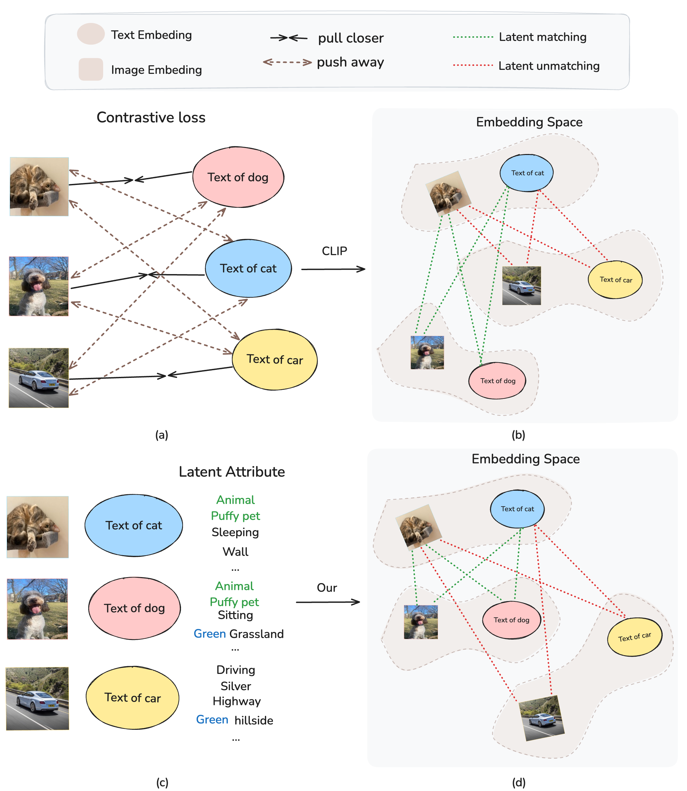

# [ICCV2025] RankCLIP

## 📣 News
- **_(2025.6.29)_**: ✨Our paper is accepted to ICCV2025❗️
- **_(2024.9.15)_**: ✨Code has been released❗️


Self-supervised contrastive learning models, such as CLIP, have set new benchmarks for vision-language models in many downstream tasks. However, their dependency on rigid oneto-one mappings overlooks the complex and often multifaceted relationships between and within texts and images. To this end, we introduce RANKCLIP, a novel pretraining method that extends beyond the rigid one-to-one matching framework of CLIP and its variants. By extending the traditional pair-wise loss to listwise, and leveraging both in-modal and crossmodal ranking consistency, RANKCLIP improves the alignment process, enabling it to capture the nuanced many-to-many relationships between and within each modality. Through comprehensive experiments, we demonstrate the effectiveness of RANKCLIP in various downstream tasks, notably achieving significant gains in zero-shot classifications over stateof-the-art methods, underscoring the importance of this enhanced learning process.




## 🛠️ Requirements and Installation

- Python >= 3.10
- Pytorch >= 2.0.1
- CUDA Version >= 11.7
- Install required packages:
```bash 
git clone https://github.com/Jam1ezhang/RankCLIP.git
cd RankCLIP
conda create -n rankclip python=3.10 -y
conda activate rankclip
pip install -r requirement.txt
```

## 🗝️Training

```
python -m rankclip.main --name exp1 --train_data <path to train csv file> --validation_data <path to valid csv file>
--image_key <column name of the image paths in the train/validation csv file> --caption_key <column name of the captions
in the train/validation csv file>  
```

 `data/` contains sample train and validation CSV/TSV files. This script does not download the images for the captions directly. To download the images from their URL for CC3M and CC12M, use our `utils/download.py` script. (btw, some URLs maybe corrupted)

## 🤖Inference 

For ImageNet1K
```
python -m rankclip.main --name <eval_imagenet_1k> --eval_data_type <dataset> --eval_test_data_dir data/ImageNet1K/validation/ --device_id 0 --checkpoint <ckpts/epoch_64.pt> 
```
Our checkpoints are here [ViT_checkpoint_cc3m](https://drive.google.com/file/d/1Ap1HL6QmlNIBHu2vN4flHMsL9H2L04rh/view?usp=drive_link)  [ViT_checkpoint_yfcc15m](https://drive.google.com/file/d/1TfzQl9u33wZMMpbIUbQ857mnPFE5A4n9/view?usp=drive_link)
## 🔒 Licenses

You can use, redistribute, and adapt the material for non-commercial purposes, as long as you give appropriate credit by citing our paper and indicating any changes that you've made.The service is a research preview intended for non-commercial use only.

## 👍 Acknowledgement

Some portions of the code in this repository are adaptations from the following repositories: [mlfoundations](https://github.com/mlfoundations/open_clip) and [openai](https://github.com/openai/CLIP).

## 📚 Citation

If you find this work useful in your research, please consider citing:

```bibtex
@InProceedings{Zhang_2025_ICCV,
    author    = {Zhang, Yiming and Zhao, Zhuokai and Chen, Zhaorun and Feng, Zhili and Ding, Zenghui and Sun, Yining},
    title     = {RANKCLIP: Ranking-Consistent Language-Image Pretraining},
    booktitle = {Proceedings of the IEEE/CVF International Conference on Computer Vision (ICCV)},
    month     = {October},
    year      = {2025},
    pages     = {3874-3884}
}
```

